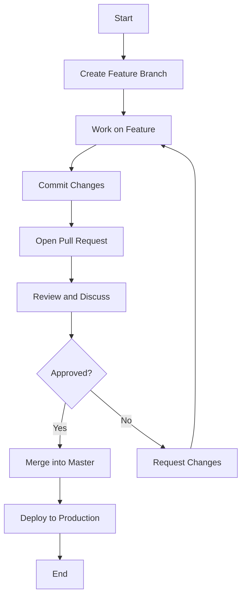

# Getting Started with GitHub Flow (in progress...)

This guide is a collection of resources to help you get started with GitHub Flow. It's a work in progress.

## Description

Key Concepts of GitHub Flow

1.  Master Branch (or Main)

- This is the default branch where the source code is always in a deployable state. It should only contain production-ready code.

2. Feature Branches

- Developers create feature branches off the master branch to work on specific tasks, such as adding new features, fixing bugs, or refactoring code.

3. Commits

- Changes are committed to the feature branch. Each commit should be a logical, atomic change that can be reviewed and tested independently.

4. Pull Requests

- When the feature is complete, a pull request (PR) is created to merge the feature branch back into the master branch. This is a chance for code review, discussions, and additional testing.

5. Review & Merge

- After the pull request is approved, it is merged into the master branch. The merge typically triggers an automated deployment or build process.

6. Deploy

- Once merged, the changes on the master branch are deployed to production. This can be automated or done manually.

### GitHub Flow with Mermaid Diagram

Explanation of the Diagram:
- **Start**: The workflow begins when a developer decides to start working on a new feature or bug fix.
- **Create Feature Branch**: The developer creates a new branch off the master branch.
- **Work on Feature**: The developer works on the feature or bug fix in the feature branch.
- **Commit Changes**: The developer commits changes to the feature branch regularly.
- **Open Pull Request**: Once the feature is complete, a pull request is opened to merge the changes back into the master branch.
- **Review and Discuss**: Team members review the pull request, suggest changes if necessary, and discuss the implementation.
- **Approved?**: If the pull request is approved, it moves to the next step. If not, the developer makes the requested changes and commits them.
- Merge into Master**: The approved pull request is merged into the master branch.
- **Deploy to Production**: The changes in the master branch are deployed to production, completing the workflow.
- **End**: The process ends, and the master branch is now updated with the latest production-ready code.

## Demo

## Features

- feature:1
- feature:2

## Requirement

## Usage

## Installation

## References

## Licence

Released under the [MIT license](https://gist.githubusercontent.com/shinyay/56e54ee4c0e22db8211e05e70a63247e/raw/f3ac65a05ed8c8ea70b653875ccac0c6dbc10ba1/LICENSE)

## Author

- github: <https://github.com/shinyay>
- twitter: <https://twitter.com/yanashin18618>
- mastodon: <https://mastodon.social/@yanashin>
