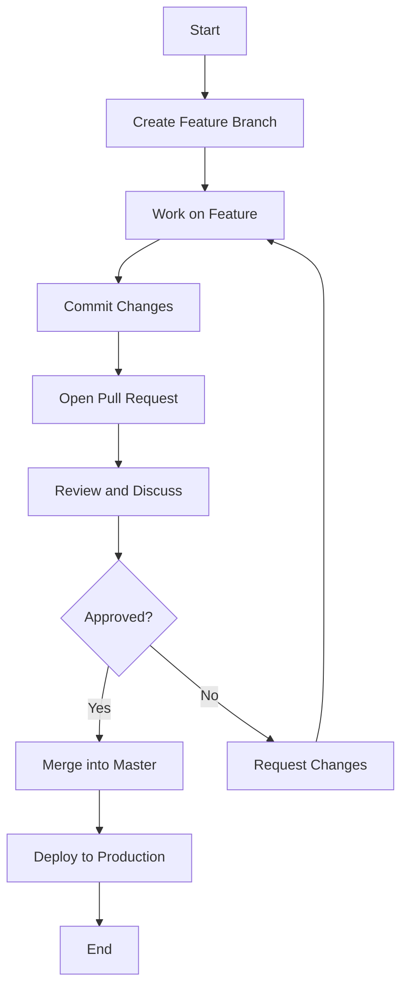

# Getting Started with GitHub Flow (in progress...)

This guide is a collection of resources to help you get started with GitHub Flow. It's a work in progress.

## Description

## Demo

## Features

- feature:1
- feature:2

## Requirement

## Usage

## Installation

## References

## Licence

Released under the [MIT license](https://gist.githubusercontent.com/shinyay/56e54ee4c0e22db8211e05e70a63247e/raw/f3ac65a05ed8c8ea70b653875ccac0c6dbc10ba1/LICENSE)

## Author

- github: <https://github.com/shinyay>
- twitter: <https://twitter.com/yanashin18618>
- mastodon: <https://mastodon.social/@yanashin>
